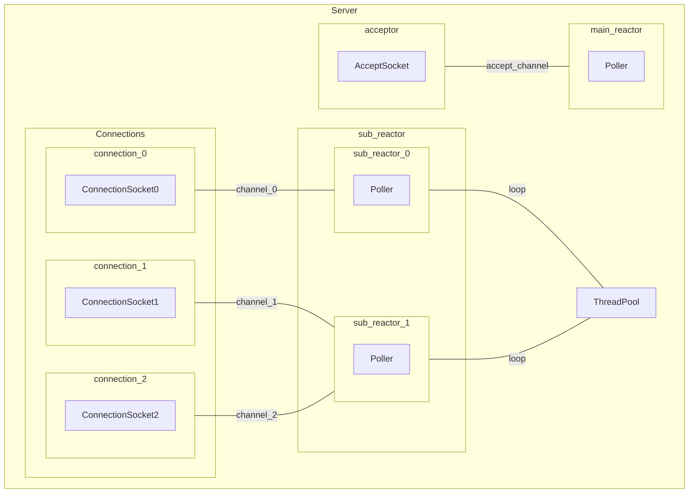

# WebServer

A C++ Web Server with the technical points below:

- Reactor pattern
- Epoll
- Thread Pool

## Architecture



## Build

```bash
mkdir build && cd build
cmake ..
make

make format     # optional
make cpplint    # optional
make clang-tidy # optional
```

## Run

### Echo Service

#### Run echo server

```bash
# at build/
./bin/echo_server
```

#### Run echo client

```bash
# at build/

./bin/echo_client
# or
./bin/echo_clients

```

### Chat service

#### Run chat server

```bash
# at build/
./bin/chat_server
```

#### Run chat client

```bash
# at build/
./bin/chat_client
```
